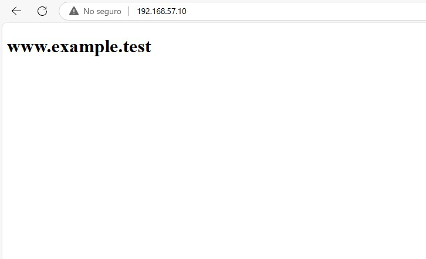
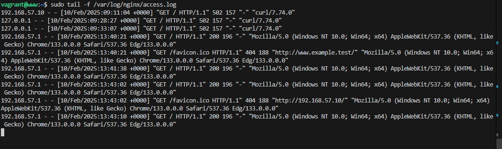
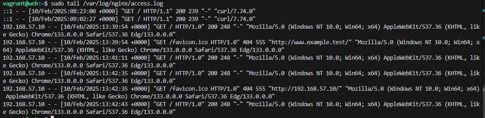
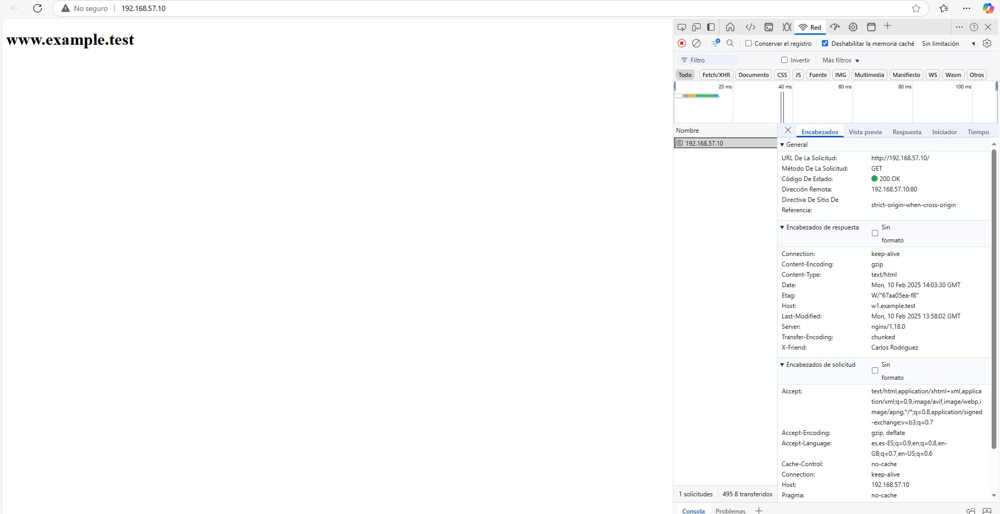
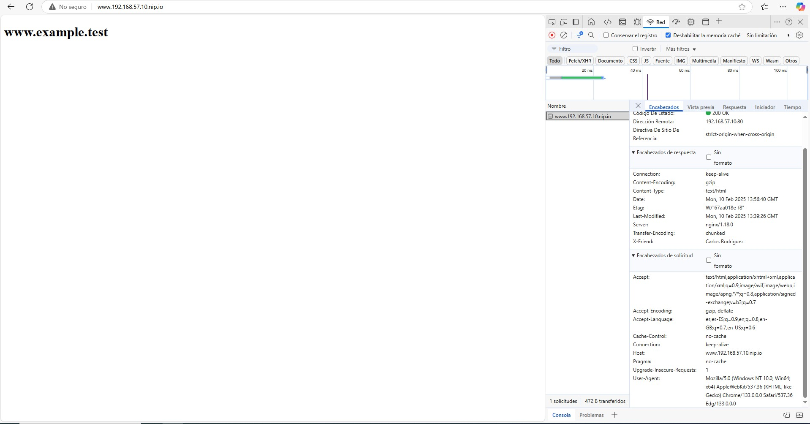

# Configuración de Proxy Inverso con Nginx en Debian

**Autor: Carlos Rodríguez**

Este proyecto implementa un sistema de proxy inverso utilizando dos servidores Debian con Nginx.

## Arquitectura

### Diagrama de red

**Componentes:**
- **Servidor Web (w1)**
    - IP: 192.168.57.11
    - Puerto: 8080
- **Proxy Inverso**
    - IP: 192.168.57.10
    - Puerto: 80
    - URL: www.example.test

## Configuración Vagrant

```ruby
Vagrant.configure("2") do |config|
    config.vm.box = "debian/bullseye64"
    config.vm.provider "virtualbox" do |vb|
        vb.memory = "256"
    end
    config.vm.provision "shell", inline: <<-SHELL
        apt-get update && apt-get install -y nginx
    SHELL
    config.vm.define "proxy" do |proxy|
        proxy.vm.hostname = "www.example.test"
        proxy.vm.network "private_network", ip: "192.168.57.10"
    end
    config.vm.define "web" do |web|
        web.vm.hostname = "w1.example.test"
        web.vm.network "private_network", ip: "192.168.57.11"
    end
end
```

## Configuración del Servidor Web (w1)

```nginx
server {
    listen 8080;
    listen [::]:8080;
    server_name w1;
    root /var/www/html;
    index index.html index.htm;
    location / {
        try_files $uri $uri/ =404;
    }
}
```

### Página web de prueba

```html
<!DOCTYPE html>
<html lang="en">
<head>
    <meta charset="UTF-8">
    <meta name="viewport" content="width=device-width, initial-scale=1.0">
    <title>example.test</title>
</head>
<body>
    <h1>example.test</h1>
    <h2>Bienvenido</h2>
    <p>Servidor w1</p>
</body>
</html>
```

## Configuración del Proxy Inverso

### Configuración de hosts

```bash
192.168.57.11 w1
```

### Configuración Nginx

```nginx
server {
    listen 80;
    listen [::]:80;
    server_name example.test www.example.test;
    location / {
        proxy_pass http://192.168.57.11:8080;
    }
}
```

## Verificación y Pruebas

### Verificar logs

```bash
# En proxy
sudo tail /var/log/nginx/access.log

# En web
sudo tail /var/log/nginx/access.log
```

### Añadir cabeceras personalizadas

```nginx
# En proxy - /etc/nginx/sites-available/default
location / {
    proxy_pass http://192.168.57.11:8080;
    add_header X-friend "Carlos Rodriguez";
}

# En web - /etc/nginx/sites-enabled/default
location / {
    add_header Host w1.example.test;
    try_files $uri $uri/ =404;
}
```

## Comprobaciones

Para verificar el funcionamiento:
1. Acceder a http://192.168.57.10

2. Verificar logs en ambos servidores
3. Comprobar cabeceras HTTP en las herramientas de desarrollo del navegador
4. Verificar redirección funcionando correctamente

## Capturas
1. Logs del proxy

2. Logs del web

3. Cabeceras x-friend

4. Cabeceras Host desde el web


## Notas adicionales

Para acceder usando DNS alternativo:

```bash
www.192.168.57.10.nip.io
```


